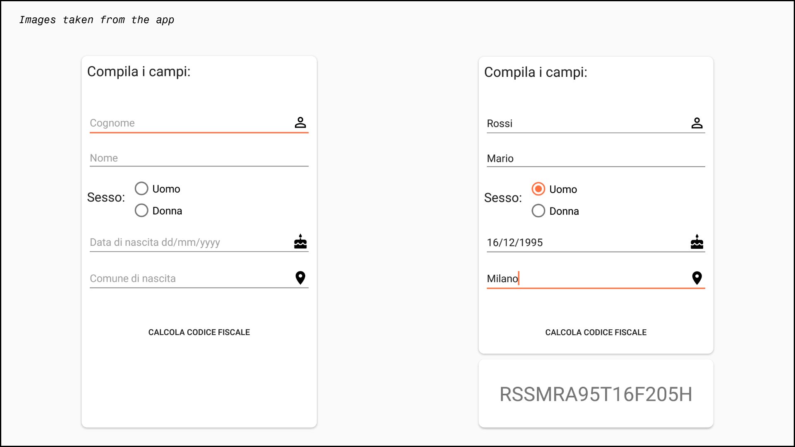

# CodiceFiscaleUtil-Android

[](https://jitpack.io/#GangemiLorenzo/CodiceFiscaleUtil-Android)

Android library to build the Italian Codice Fiscale, once given the correct info.



## Installation

Add it in your root build.gradle at the end of repositories:

```
	allprojects {
		repositories {
			...
			maven { url 'https://jitpack.io' }
		}
	}
```

 Add the dependency

```
	dependencies {
	        implementation 'com.github.GangemiLorenzo:CodiceFiscaleUtil-Android:v0.1-beta'
	}
```

## Getting started

Init the builder class

```
CF_Builder.init(Context);
```

Load the personal data

```
PersonalData p = new PersonalData(
                        name,       // String ("Mario")
                        surname,    // String ("Rossi")
                        dd,         // String ("16")
                        mm,         // String ("03")
                        yyyy,       // String ("1985")
                        sex,        // boolean value  (Man = true, Female = false)
                        birthplace  // String ("Milan")
                );
```

Get the code

```
String codice_fiscale = CF_Builder.build(p);
```

## Built With

* [gson](https://github.com/google/gson)


## License

This project is licensed under the MIT License - see the [LICENSE.md](https://github.com/GangemiLorenzo/CodiceFiscaleUtil-Android/blob/master/LICENSE) file for details